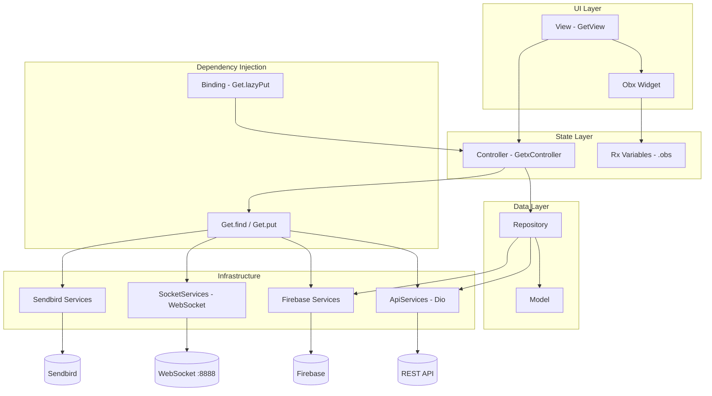
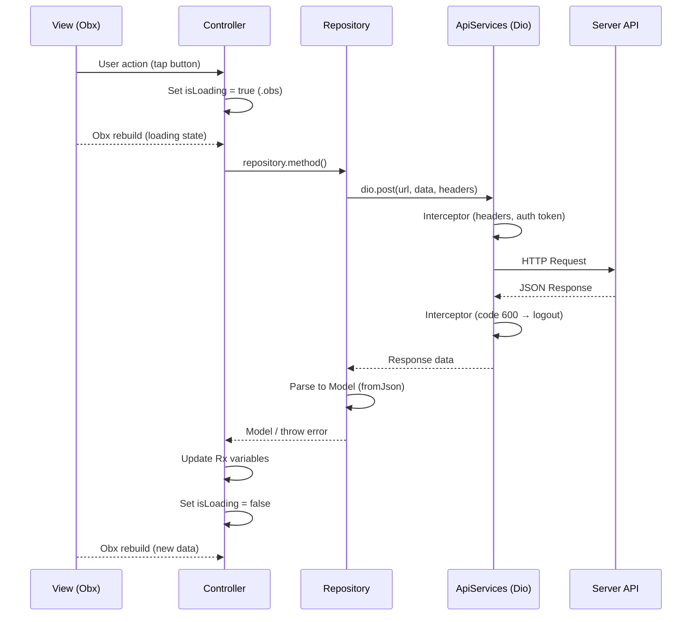

# Project Architecture

## Overview

**new_evmoto_user** adalah aplikasi mobile Flutter untuk pemesanan kendaraan listrik (ride-hailing). Aplikasi ini mendukung alur pemesanan ride on-demand dan advanced booking, pelacakan driver real-time, chat/voice call via Sendbird, manajemen akun, voucher/promo, serta pengaturan lokasi tersimpan.

Target pengguna: end-user (role `user`) yang memesan perjalanan melalui platform Evmoto.

---

## Tech Stack

| Kategori | Teknologi | Versi / Detail |
|---|---|---|
| **Flutter** | Flutter SDK | `3.38.9` (via `.fvm/fvm_config.json`) |
| **Dart** | Dart SDK | `^3.9.2` (`pubspec.yaml`) |
| **State Management** | GetX | `^4.7.3` |
| **Dependency Injection** | GetX (`Get.put`, `Get.lazyPut`, `Get.find`) | Built-in GetX |
| **Routing** | GetX (`GetMaterialApp`, `GetPage`, `Get.toNamed`) | Built-in GetX |
| **Networking** | Dio | `^5.9.2` |
| **Local Storage** | `flutter_secure_storage`, `shared_preferences` | Token & device ID di secure storage; preferensi di SharedPreferences |
| **Testing Framework** | `flutter_test` | Hanya `test/widget_test.dart` (default template, belum diadaptasi) |
| **CLI Generator** | `get_cli` | `^1.9.1` (dev dependency) |

### Dependensi Penting Lainnya

- **Maps:** `google_maps_flutter`, `geolocator`, `flutter_animarker`
- **Forms:** `reactive_forms`
- **Firebase:** `firebase_core`, `firebase_crashlytics`, `firebase_remote_config`, `firebase_messaging`, `firebase_storage`, `cloud_firestore`
- **Chat/Call:** `sendbird_chat_sdk`, `flutter_callkit_incoming`
- **UI:** `google_fonts`, `flutter_svg`, `carousel_slider`, `shimmer`, `sliding_up_panel`
- **Deep Link:** `app_links`
- **Real-time:** Custom WebSocket (`dart:io` Socket) via `SocketServices`

---

## Architecture Pattern

Proyek ini menggunakan kombinasi pola berikut:

| Pola | Status | Keterangan |
|---|---|---|
| **Feature First** | ✅ Digunakan | Setiap fitur di `lib/app/modules/<feature>/` dengan `bindings/`, `controllers/`, `views/` |
| **Modular Architecture** | ✅ Digunakan | 37 modul fitur terpisah, di-generate/dikelola via Get CLI |
| **MVC (GetX)** | ✅ Digunakan | View (`GetView`) → Controller (`GetxController`) → Repository (plain class) |
| **Layered Architecture** | ⚠️ Parsial | Ada pemisahan `data/`, `repositories/`, `services/`, `modules/` — tanpa layer domain/usecase |
| **Clean Architecture** | ❌ Tidak ditemukan | Tidak ada folder `domain/`, use case, atau entity terpisah dari model |
| **MVVM** | ❌ Tidak digunakan | Tidak ada ViewModel; Controller langsung menangani logic |

**Kesimpulan:** Arsitektur utama adalah **Feature-First Modular MVC dengan GetX**, dilengkapi **Repository Pattern** untuk akses data.

---

## Folder Structure

```
lib/
├── main.dart                    # Entry point, inisialisasi Firebase & global services
├── environment.dart             # Konfigurasi baseUrl, socketUrl, env (dev/prod)
├── firebase_options.dart        # Konfigurasi Firebase (FlutterFire)
└── app/
    ├── data/
    │   ├── constants/           # Konstanta bisnis (mis. OrderState)
    │   └── models/              # Data model / DTO (fromJson/toJson)
    ├── modules/                 # 37 modul fitur (feature-first)
    │   └── <feature>/
    │       ├── bindings/        # Dependency injection per route
    │       ├── controllers/     # Business logic & state (GetxController)
    │       └── views/           # UI widgets (GetView + sub-views)
    ├── repositories/            # Akses API & data persistence
    ├── routes/
    │   ├── app_pages.dart       # Definisi GetPage & route list
    │   └── app_routes.dart      # Konstanta nama route (generated Get CLI)
    ├── services/                # Global singleton services (GetxService)
    ├── utils/                   # Helper functions (static/utility)
    └── widgets/                 # Reusable widgets lintas modul
```

> **Catatan:** Folder `core/` **tidak ditemukan** di repository ini. Konfigurasi environment berada di `lib/environment.dart`, bukan di layer core terpisah.

### Fungsi Setiap Folder

| Folder | Fungsi |
|---|---|
| `lib/main.dart` | Bootstrap aplikasi: Firebase, Crashlytics, registrasi global services, `GetMaterialApp` |
| `lib/environment.dart` | Konstanta URL API, socket, prefix Sendbird, environment flag |
| `app/data/models/` | Model data hasil parsing JSON API (28 model) |
| `app/data/constants/` | Konstanta status order (`OrderState`) |
| `app/modules/` | Fitur UI terisolasi per domain bisnis |
| `app/repositories/` | Abstraksi akses data ke REST API via Dio (16 repository) |
| `app/routes/` | Centralized routing GetX |
| `app/services/` | Layanan global: API client, socket, lokasi, bahasa, tema, push notification, Sendbird |
| `app/utils/` | Helper: maps, snackbar, order, socket, time, common |
| `app/widgets/` | Komponen UI reusable: dialog, bottomsheet, loading, global handler |

---

## Dependency Flow

Alur dependency aktual di proyek ini:

```
View (GetView + Obx)
    ↓
Controller (GetxController)
    ↓ (constructor injection via Binding)
Repository (plain Dart class)
    ↓
ApiServices.dio (Dio) / FirebaseStorage / Firestore
    ↓
REST API / Firebase / WebSocket
```

Controller juga mengakses **global services** langsung via `Get.find<Service>()`:

```
Controller
    ↓ Get.find
Global Services (GetxService — permanent di main.dart)
    ├── ApiServices
    ├── SocketServices
    ├── LocationServices
    ├── LanguageServices
    ├── ThemeColorServices
    ├── TypographyServices
    ├── FirebaseRemoteConfigServices
    ├── FirebasePushNotificationServices
    ├── SendbirdServices / SendbirdChatServices
    ├── UserServices
    └── DeepLinkServices
```

### Diagram Mermaid



---

## GetX Usage

### Routing

- **`GetMaterialApp`** di `main.dart` dengan `initialRoute: AppPages.INITIAL` (`/splash-screen`)
- **37 route** didefinisikan di `app_pages.dart` sebagai `GetPage`
- Navigasi via `Get.toNamed()`, `Get.offNamed()`, `Get.offAllNamed()`
- Route HOME menggunakan **multiple bindings**: `HomeBinding()`, `AccountBinding()`, `ActivityBinding()`
- `routingCallback` di `main.dart` refresh data saat kembali ke HOME

```dart
// Contoh registrasi route
GetPage(
  name: _Paths.HOME,
  page: () => const HomeView(),
  bindings: [HomeBinding(), AccountBinding(), ActivityBinding()],
),
```

### Bindings

- Setiap modul memiliki `*Binding extends Bindings`
- Pattern utama: `Get.lazyPut<Controller>(() => Controller(repository: Repository()))`
- Repository di-instantiate langsung di binding (bukan di-register terpisah ke GetX)
- 17 dari 37 modul meng-inject repository via constructor

### Controllers

- Semua controller extends `GetxController`
- State reaktif via `.obs` (contoh: `final isFetch = false.obs`)
- Lifecycle: `onInit()`, `onReady()`, `onClose()`
- Controller besar seperti `HomeController` (~1600+ baris) dan `RideOrderDetailController` (~2200+ baris) menangani banyak logic

### Services

11 global services di-register di `main.dart` dengan `Get.put(..., permanent: true)`:

| Service | Tanggung Jawab |
|---|---|
| `ThemeColorServices` | Palet warna design system (Rx Color) |
| `TypographyServices` | Style teks Google Fonts Nunito Sans (Rx TextStyle) |
| `LanguageServices` | i18n via Firebase Remote Config + SharedPreferences |
| `ApiServices` | Dio client, interceptors, header otomatis, error handling |
| `FirebaseRemoteConfigServices` | Remote config Firebase |
| `FirebasePushNotificationServices` | FCM, local notification, CallKit incoming call |
| `SocketServices` | WebSocket real-time (driver position, order events) |
| `SendbirdServices` | Voice call Sendbird |
| `SendbirdChatServices` | Chat Sendbird |
| `LocationServices` | Geolokasi user |
| `DeepLinkServices` | Deep link scheme `evmoto://` |
| `UserServices` | State user global (loading refresh home) |

### Dependency Injection

| Metode | Penggunaan |
|---|---|
| `Get.put(..., permanent: true)` | Global services di `main.dart` |
| `Get.lazyPut(() => Controller())` | Controller per route di Binding |
| `Get.find<Service>()` | Akses service/controller dari mana saja |
| Constructor injection | Repository ke Controller via Binding |

---

## Feature Modules

| Feature | Controller | Binding | View | Service (Get.find utama) |
|---|---|---|---|---|
| splash_screen | SplashScreenController | SplashScreenBinding | SplashScreenView | UserServices, LocationServices |
| login_register | LoginRegisterController | LoginRegisterBinding | LoginRegisterView | ThemeColor, Typography, Language |
| login_register_verification_otp | LoginRegisterVerificationOtpController | LoginRegisterVerificationOtpBinding | LoginRegisterVerificationOtpView | LocationServices, UserServices |
| onboarding_registration_form | OnboardingRegistrationFormController | OnboardingRegistrationFormBinding | OnboardingRegistrationFormView | UserServices |
| home | HomeController | HomeBinding | HomeView | Socket, Firebase, Sendbird, Location, User |
| account | AccountController | AccountBinding | AccountView | Socket, FirebaseRemoteConfig, HomeController |
| activity | ActivityController | ActivityBinding | ActivityView | HomeController |
| activity_detail | ActivityDetailController | ActivityDetailBinding | ActivityDetailView | FirebaseRemoteConfig, HomeController |
| add_edit_address | AddEditAddressController | AddEditAddressBinding | AddEditAddressView | SettingSavedLocationController |
| add_edit_address_other | AddEditAddressOtherController | AddEditAddressOtherBinding | AddEditAddressOtherView | LocationServices |
| search_address | SearchAddressController | SearchAddressBinding | SearchAddressView | LocationServices |
| setting_language | SettingLanguageController | SettingLanguageBinding | SettingLanguageView | LanguageServices |
| setting_saved_location | SettingSavedLocationController | SettingSavedLocationBinding | SettingSavedLocationView | — |
| privacy_policy | PrivacyPolicyController | PrivacyPolicyBinding | PrivacyPolicyView | — |
| terms_and_conditions | TermsAndConditionsController | TermsAndConditionsBinding | TermsAndConditionsView | — |
| add_edit_user_information | AddEditUserInformationController | AddEditUserInformationBinding | AddEditUserInformationView | HomeController |
| photo_viewer | PhotoViewerController | PhotoViewerBinding | PhotoViewerView | — |
| voucher_list | VoucherListController | VoucherListBinding | VoucherListView | — |
| create_order_ride | CreateOrderRideController | CreateOrderRideBinding | CreateOrderRideView | LocationServices |
| create_order_ride_checkout | CreateOrderRideCheckoutController | CreateOrderRideCheckoutBinding | CreateOrderRideCheckoutView | HomeController, LocationServices |
| create_order_ride_promo | CreateOrderRidePromoController | CreateOrderRidePromoBinding | CreateOrderRidePromoView | CreateOrderRideCheckoutController |
| create_order_ride_map_select | CreateOrderRideMapSelectController | CreateOrderRideMapSelectBinding | CreateOrderRideMapSelectView | — |
| ride_order_detail | RideOrderDetailController | RideOrderDetailBinding | RideOrderDetailView | Socket, SendbirdChat, FirebaseRemoteConfig |
| ride_order_done | RideOrderDoneController | RideOrderDoneBinding | RideOrderDoneView | HomeController |
| ride_order_cancel | RideOrderCancelController | RideOrderCancelBinding | RideOrderCancelView | — |
| ride_checkout_select_payment_method | RideCheckoutSelectPaymentMethodController | RideCheckoutSelectPaymentMethodBinding | RideCheckoutSelectPaymentMethodView | — |
| account_payment_method | AccountPaymentMethodController | AccountPaymentMethodBinding | AccountPaymentMethodView | — |
| add_account_payment_method | AddAccountPaymentMethodController | AddAccountPaymentMethodBinding | AddAccountPaymentMethodView | — |
| account_payment_method_gopay_detail | AccountPaymentMethodGopayDetailController | AccountPaymentMethodGopayDetailBinding | AccountPaymentMethodGopayDetailView | — |
| advanced_booking_detail | AdvancedBookingDetailController | AdvancedBookingDetailBinding | AdvancedBookingDetailView | FirebaseRemoteConfig, HomeController |
| advanced_booking_searching_driver | AdvancedBookingSearchingDriverController | AdvancedBookingSearchingDriverBinding | AdvancedBookingSearchingDriverView | — |
| chat_list | ChatListController | ChatListBinding | ChatListView | UserServices |
| chat_detail | ChatDetailController | ChatDetailBinding | ChatDetailView | HomeController |
| sendbird_chat_list | SendbirdChatListController | SendbirdChatListBinding | SendbirdChatListView | SendbirdChatServices, HomeController |
| sendbird_chat_detail | SendbirdChatDetailController | SendbirdChatDetailBinding | SendbirdChatDetailView | SendbirdChatServices, HomeController |
| ride_chat_sendbird | RideChatSendbirdController | RideChatSendbirdBinding | RideChatSendbirdView | SendbirdChatServices, HomeController |
| ride_call_sendbird | RideCallSendbirdController | RideCallSendbirdBinding | RideCallSendbirdView | SendbirdServices |

### Repositories (16)

| Repository | Digunakan Oleh |
|---|---|
| `UserRepository` | Home, Account, AddEditUserInformation, Onboarding |
| `OrderRideRepository` | Home, Account, Activity, ActivityDetail, CreateOrderRide, Checkout, RideOrderDetail/Done/Cancel |
| `AdvanceBookingRepository` | Activity, AdvancedBookingDetail, AdvancedBookingSearchingDriver, Checkout |
| `CouponRepository` | Home, Checkout, CreateOrderRidePromo, VoucherList |
| `SavedAddressRepository` | Home, CreateOrderRide, AddEditAddress, SettingSavedLocation |
| `GeocodingRepository` | Home, CreateOrderRide, SearchAddress, MapSelect, Checkout, AddEditAddressOther |
| `DriverNearbyRepository` | Home, MapSelect, Checkout, RideOrderDetail, AdvancedBookingSearchingDriver |
| `AdvertisementRepository` | Home |
| `VersioningServerRepository` | Home |
| `OtpRepository` | Account, LoginRegisterVerificationOtp |
| `LoginRegisterRepository` | LoginRegisterVerificationOtp |
| `AgreementRepository` | PrivacyPolicy, TermsAndConditions |
| `UploadImageRepository` | AddEditUserInformation, ChatDetail |
| `OpenMapsRepository` | ActivityDetail, AdvancedBookingDetail, Checkout, RideOrderDetail |
| `NotificationRepository` | FirebasePushNotificationServices |
| `QueryImageRepository` | SplashScreen |

---

## Data Flow

### Alur Umum: UI → API → UI



### Autentikasi API

1. Token disimpan di `FlutterSecureStorage` (key: `token`)
2. Repository membaca token dan menambahkan header `Authorization: Bearer <token>`
3. `ApiServices` menambahkan header otomatis: `version`, `deviceid`, `timestamp`, `from`, `role`, `nonce`
4. Response `code: 600` → auto logout & redirect ke login

### Real-time Data (WebSocket)

1. `SocketServices` connect ke `socketUrl:8888` saat user login
2. Event seperti `DRIVER_POSITION` di-handle dan diteruskan ke controller aktif (`RideOrderDetailController`, `HomeController`)
3. Ping/pong monitoring ditampilkan di dev banner

### Bahasa / i18n

1. String UI disimpan di Firebase Remote Config
2. `LanguageServices` load JSON bahasa ke `Language` model
3. Preferensi bahasa disimpan di SharedPreferences (`language_code`)
4. View mengakses via `controller.languageServices.language.value.<key>`

---

## Shared Components

### Reusable Widgets (`app/widgets/`)

| Widget | Fungsi |
|---|---|
| `global_body_handler.dart` | Wrapper body dengan handling umum |
| `loader_elevated_button_widget.dart` | Tombol dengan state loading |
| `loading_dialog.dart` | Dialog loading |
| `access_location_required_widget.dart` | Prompt izin lokasi |
| `driver_nearby_position_widget.dart` | Marker driver terdekat di map |
| `driver_cancel_dialog.dart` | Dialog driver membatalkan order |
| `advanced_booking_cancel_dialog.dart` | Dialog cancel advanced booking |
| `advanced_booking_expired_dialog.dart` | Dialog booking expired |
| `dashed_line.dart` | Garis putus-putus dekoratif |
| `dialogs/payment_method_gopay_*` | Dialog GoPay (bind, unbind, main method, success) |
| `dialogs/order_free_cancellation_fee_dialog.dart` | Dialog biaya cancel gratis |
| `bottomsheets/order_checkout_additional_cancellation_fee_bottomsheet.dart` | Bottomsheet biaya cancel tambahan |

### Utilities (`app/utils/`)

| File | Fungsi |
|---|---|
| `common_helper.dart` | Helper umum: logout, format, dialog |
| `snackbar_helper.dart` | Tampilkan snackbar error/success |
| `maps_helper.dart` | Utilitas peta |
| `google_maps_helper.dart` | Helper Google Maps |
| `order_helper.dart` | Logic terkait status order |
| `socket_helper.dart` | Konversi byte socket ke JSON |
| `time_process_helper.dart` | Pengukuran waktu proses (debug) |
| `general_helper.dart` | Helper generik |

### Extensions

**Not Found** — Tidak ada file extension (`extension ...`) di `lib/`.

### Constants

| Lokasi | Isi |
|---|---|
| `app/data/constants/order_state_const.dart` | Status order (`OrderState`: LOOKING_FOR_DRIVER, DRIVER_ACCEPT_ORDER, dll.) |
| `environment.dart` | `baseUrl`, `socketUrl`, `prefixSendbirdUser/Driver`, `env` |

### Themes

Tidak menggunakan `ThemeData` terpusat secara penuh. Design system diimplementasikan via:

- **`ThemeColorServices`** — 35 warna reaktif (primary blue, semantic colors, neutrals)
- **`TypographyServices`** — 11 text style reaktif (Nunito Sans via Google Fonts)
- `main.dart` hanya mengatur `textSelectionTheme` dari `ThemeColorServices`

---

## State Management

### Obx

- **Digunakan secara luas** di hampir semua view dan sub-view (~90+ file)
- Membungkus widget yang perlu rebuild saat Rx variable berubah
- Contoh: `HomeView` membungkus seluruh scaffold dengan `Obx(() => ...)`

### GetBuilder

**Not Found** — Tidak ada penggunaan `GetBuilder` di codebase.

### Rx Variables

- Pattern: `final variableName = <Type>value.obs`
- Tipe umum: `bool`, `int`, `String`, `List<Model>`, `Color`, `TextStyle`
- Diakses di view: `controller.variableName.value`
- Services global juga menggunakan `.obs` (ThemeColorServices, TypographyServices, LanguageServices)

### Workers

| Worker | Lokasi | Penggunaan |
|---|---|---|
| `ever()` | `ride_order_detail_controller.dart` | Listen perubahan `state` order untuk refresh data & update map |
| `once()` | Not Found | — |
| `debounce()` | Not Found | — |
| `interval()` | Not Found | — |

---

## Navigation Structure

**Initial Route:** `/splash-screen`

| Route | Page | Binding |
|---|---|---|
| `/home` | HomeView | HomeBinding, AccountBinding, ActivityBinding |
| `/splash-screen` | SplashScreenView | SplashScreenBinding |
| `/login-register` | LoginRegisterView | LoginRegisterBinding |
| `/login-register-verification-otp` | LoginRegisterVerificationOtpView | LoginRegisterVerificationOtpBinding |
| `/account` | AccountView | AccountBinding |
| `/activity` | ActivityView | ActivityBinding |
| `/activity-detail` | ActivityDetailView | ActivityDetailBinding |
| `/add-edit-address` | AddEditAddressView | AddEditAddressBinding |
| `/search-address` | SearchAddressView | SearchAddressBinding |
| `/setting-language` | SettingLanguageView | SettingLanguageBinding |
| `/setting-saved-location` | SettingSavedLocationView | SettingSavedLocationBinding |
| `/privacy-policy` | PrivacyPolicyView | PrivacyPolicyBinding |
| `/terms-and-conditions` | TermsAndConditionsView | TermsAndConditionsBinding |
| `/ride-order-detail` | RideOrderDetailView | RideOrderDetailBinding |
| `/ride-order-done` | RideOrderDoneView | RideOrderDoneBinding |
| `/ride-order-cancel` | RideOrderCancelView | RideOrderCancelBinding |
| `/photo-viewer` | PhotoViewerView | PhotoViewerBinding |
| `/onboarding-registration-form` | OnboardingRegistrationFormView | OnboardingRegistrationFormBinding |
| `/add-edit-user-information` | AddEditUserInformationView | AddEditUserInformationBinding |
| `/ride-call-sendbird` | RideCallSendbirdView | RideCallSendbirdBinding |
| `/ride-chat-sendbird` | RideChatSendbirdView | RideChatSendbirdBinding |
| `/sendbird-chat-list` | SendbirdChatListView | SendbirdChatListBinding |
| `/sendbird-chat-detail` | SendbirdChatDetailView | SendbirdChatDetailBinding |
| `/voucher-list` | VoucherListView | VoucherListBinding |
| `/create-order-ride` | CreateOrderRideView | CreateOrderRideBinding |
| `/create-order-ride-checkout` | CreateOrderRideCheckoutView | CreateOrderRideCheckoutBinding |
| `/create-order-ride-promo` | CreateOrderRidePromoView | CreateOrderRidePromoBinding |
| `/create-order-ride-map-select` | CreateOrderRideMapSelectView | CreateOrderRideMapSelectBinding |
| `/chat-list` | ChatListView | ChatListBinding |
| `/chat-detail` | ChatDetailView | ChatDetailBinding |
| `/advanced-booking-detail` | AdvancedBookingDetailView | AdvancedBookingDetailBinding |
| `/advanced-booking-searching-driver` | AdvancedBookingSearchingDriverView | AdvancedBookingSearchingDriverBinding |
| `/add-edit-address-other` | AddEditAddressOtherView | AddEditAddressOtherBinding |
| `/ride-checkout-select-payment-method` | RideCheckoutSelectPaymentMethodView | RideCheckoutSelectPaymentMethodBinding |
| `/account-payment-method` | AccountPaymentMethodView | AccountPaymentMethodBinding |
| `/add-account-payment-method` | AddAccountPaymentMethodView | AddAccountPaymentMethodBinding |
| `/account-payment-method-gopay-detail` | AccountPaymentMethodGopayDetailView | AccountPaymentMethodGopayDetailBinding |

### Navigasi Bottom Tab (HOME)

`HomeView` menggunakan `IndexedStack` dengan 3 tab:
1. **Home/Map** — Peta, order aktif, iklan
2. **Activity** — Riwayat order & advanced booking
3. **Account** — Profil & pengaturan

---

## External Integrations

| Integrasi | Status | Detail Implementasi |
|---|---|---|
| **REST API** | ✅ | Dio via `ApiServices`, base URL di `environment.dart` (`http://8.215.203.97:8500` — dev) |
| **WebSocket** | ✅ | Custom socket port 8888 via `SocketServices` |
| **Firebase Core** | ✅ | Inisialisasi di `main.dart` |
| **Firebase Crashlytics** | ✅ | Error reporting di `main.dart` & Dio interceptor |
| **Firebase Remote Config** | ✅ | i18n strings, Sendbird app ID, konfigurasi server |
| **Firebase Cloud Messaging** | ✅ | Push notification via `FirebasePushNotificationServices` |
| **Firebase Storage** | ✅ | Upload gambar via `UploadImageRepository` |
| **Cloud Firestore** | ✅ | Digunakan di `ChatDetailController` |
| **Sendbird Chat SDK** | ✅ | Chat antar user-driver via `SendbirdChatServices` |
| **Sendbird Voice Call** | ✅ | Voice call via `SendbirdServices` + CallKit |
| **Google Maps** | ✅ | `google_maps_flutter` di modul home, order, map select |
| **Deep Link** | ✅ | Scheme `evmoto://` via `app_links` |
| **Analytics** | **Not Found** | Tidak ada `firebase_analytics` di dependencies |
| **Payment Gateway** | **Not Found** | UI GoPay/Cash ada, tetapi tidak ada SDK payment gateway (Midtrans/Xendit/dll.) di dependencies |

---

## Design Decisions

1. **Get CLI untuk scaffolding** — Route dan struktur modul di-generate via `get_cli`, terlihat dari komentar `DO NOT EDIT` di `app_routes.dart`.

2. **Repository sebagai plain class** — Repository tidak di-register ke GetX; di-instantiate langsung di Binding dan di-inject ke Controller via constructor.

3. **Global services permanent** — Semua infrastruktur (API, socket, lokasi, tema) di-register sekali di `main.dart` dengan `permanent: true`.

4. **Multi-controller per route** — Route HOME mendaftarkan 3 controller sekaligus (Home, Account, Activity) untuk bottom navigation.

5. **Sub-view pattern** — View dipecah menjadi sub-view per komponen UI (contoh: `home_view/home_map_sub_view.dart`).

6. **Reactive design system** — Warna dan typography menggunakan `.obs` sehingga bisa berubah secara reaktif (meskipun saat ini nilainya statis).

7. **i18n via Remote Config** — String bahasa tidak hardcoded; diambil dari Firebase Remote Config ke `Language` model.

8. **Secure token storage** — Token autentikasi disimpan di `FlutterSecureStorage`, bukan SharedPreferences.

9. **Custom WebSocket** — Real-time tidak menggunakan library socket.io; menggunakan `dart:io` Socket langsung.

10. **Controller-to-controller communication** — Beberapa controller mengakses controller lain via `Get.find<OtherController>()` (contoh: `CreateOrderRideCheckoutController` → `HomeController`).

11. **Reactive Forms** — Form validasi menggunakan `reactive_forms` di modul address, onboarding, cancel order, rating.

12. **Dev environment indicator** — Banner "Dev" dan socket ping monitor hanya tampil saat `env == "dev"`.

13. **Auto logout on API 600** — Dio interceptor menangani session expired secara global.

14. **SharedPreferences flags** — Controller registration di-track via prefs (`home_controller_registered`, `activity_controller_registered`) untuk refresh saat routing callback.

---

## Improvement Opportunities

### Refactoring

- **Pecah controller besar** — `HomeController` (~1600 baris) dan `RideOrderDetailController` (~2200 baris) perlu dipecah ke use case / mixin / sub-controller.
- **Kurangi coupling antar controller** — Hindari `Get.find<OtherController>()`; gunakan shared state service atau event bus.
- **Standarisasi error handling** — Beberapa repository `rethrow` DioException, beberapa throw string message; perlu pattern konsisten.
- **Hapus duplikasi binding** — Route HOME mendaftarkan `AccountBinding` dan `ActivityBinding` yang sudah ada di `HomeBinding`.

### Performance

- **Lazy loading repository** — Repository di-instantiate baru setiap binding; pertimbangkan singleton untuk repository yang stateless.
- **Obx scope** — Banyak view membungkus seluruh scaffold dengan `Obx`; persempit scope rebuild ke widget spesifik.
- **Map marker optimization** — Modul map-heavy (home, ride detail) berpotensi memory leak; audit lifecycle marker dan polyline.

### Scalability

- **Tambah layer domain** — Pisahkan business logic dari controller ke use case classes untuk testability.
- **Centralized state** — Pertimbangkan shared state management untuk data order/user yang diakses banyak modul.
- **Environment management** — `environment.dart` saat ini hardcoded; gunakan flavor/build config untuk dev/staging/prod.

### Maintainability

- **Testing** — `test/widget_test.dart` masih template default (referensi `MyApp` yang tidak ada); perlu setup test infrastructure.
- **Tambah unit test** — Repository dan controller kritis (order, payment, auth) belum memiliki test.
- **Dokumentasi API contract** — Repository methods tidak memiliki dokumentasi endpoint; tambahkan reference ke API docs.
- **Payment integration** — Modul payment method (GoPay) masih UI-only; perlu integrasi API backend saat ready.

---

## Architecture Summary

1. Aplikasi **ride-hailing kendaraan listrik** dibangun dengan **Flutter + GetX** menggunakan pola **Feature-First Modular MVC**.
2. **37 modul fitur** terorganisir di `lib/app/modules/` dengan struktur konsisten: `bindings/`, `controllers/`, `views/`.
3. **GetX** menangani state management (`.obs` + `Obx`), routing (`GetPage`), dan dependency injection (`Get.put`/`Get.lazyPut`/`Get.find`).
4. **11 global services** (`GetxService`) di-bootstrap di `main.dart` sebagai singleton permanent.
5. **16 repository** plain class mengakses REST API via **Dio** (`ApiServices`), tanpa layer domain/usecase.
6. **28 data model** di `app/data/models/` sebagai DTO hasil parsing JSON.
7. **Real-time** ditangani via custom **WebSocket** (`SocketServices`) dan **Firebase Cloud Messaging**.
8. **Sendbird** digunakan untuk chat dan voice call antar user-driver.
9. **Firebase** digunakan untuk Crashlytics, Remote Config (i18n), FCM, Storage, dan Firestore.
10. **Google Maps** digunakan untuk peta, marker driver, dan routing visual.
11. View menggunakan **`GetView<Controller>`** + **`Obx`** untuk reactive UI; **`GetBuilder` tidak digunakan**.
12. **Workers GetX** hampir tidak digunakan; hanya `ever()` di `RideOrderDetailController`.
13. **Design system** terpusat di `ThemeColorServices` dan `TypographyServices` (bukan ThemeData Flutter).
14. **Autentikasi** berbasis Bearer token di `FlutterSecureStorage` dengan auto-logout pada response code 600.
15. Route **HOME** adalah hub utama dengan 3 tab: Map, Activity, Account — menggunakan multiple bindings.
16. Modul **payment method** (GoPay/Cash) sudah ada di UI tetapi **belum terintegrasi** dengan payment gateway SDK.
17. **Analytics** belum diimplementasikan (`firebase_analytics` tidak ada).
18. **Testing** belum disetup — hanya file template default yang tidak valid.
19. Proyek di-scaffold dengan **Get CLI** (`get_cli`) — terlihat dari struktur dan komentar generated code.
20. Environment saat ini dikonfigurasi ke **development server** (`env = "dev"`) di `environment.dart`.
